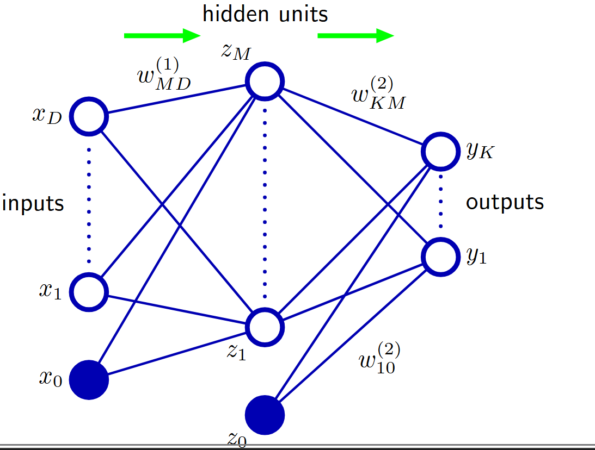

# Rede Neural

**$$a_m = \sum_i{x_i w_{mi}}$$**

**$$a = W^{(1)}x$$**

**$$z = h(a)$$**

**$$y = W^{(2)}z$$**

**$$y = W^{(2)}h(a)$$**

**$$y = \sigma(W^{(2)}h( W^{(1)}x))$$**

**$$X[n.d]$$**

**$$W^{(1)}[d.m]$$**

**$$A = X W^{(1)}[n.m]$$**

**$$W^{(2)}[m.k]$$**

**$$Z = h(A)$$**

**$$Y = W^{(2)}Z$$**

**$$Y = \sigma(W^{(2)}h(X W^{(1)}))$$**

$$W^{(1)}X$$