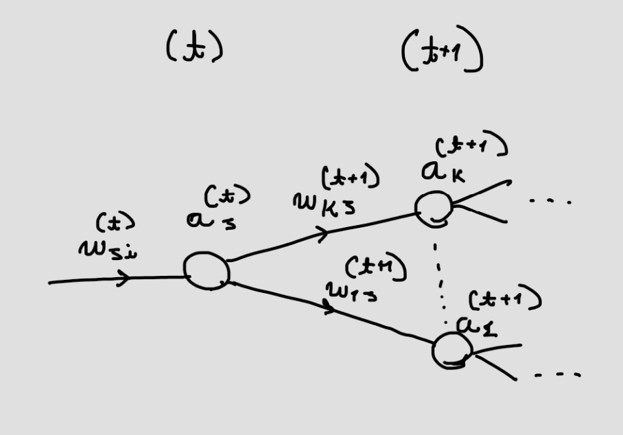

# 5. Neural Networks

---

## Error Backpropagation
- O objetivo é achar uma técnica eficiente para calcular o gradiente da função de erro **$E(\mathbf{w})$** para uma *feed-foward* rede neural.
- Para cada passo:
    1. As derivadas da função de erro em relação aos pesos é calculada.
    2. As derivadas são então usadas para ajustar os pesos 
- A técnica mais simples do tipo é a **decida do gradiente**

### Derivadas das funções de erro

Muitas funções de erro comprimem uma soma de termo, geralmente nesta forma:
**$$
E(w) = \sum_{n=1}^N{E_n(w)}
  $$**

Aqui vamos considerar o problema de calcular $\nabla E_n(w)$ para **um único** termo da função de erro

Podemos começar a análise pensando em um simples modelo linear que produz uma saída $y_k$ a partir de combinações lineares de uma entrada $x_i$, tal que

**$$
y_k = \sum_i{w_{ki}x_i}
  $$**

junto com uma função de erro tal que, para uma entrada de formato particular $n$, tome a forma 
**$$
E_n = \frac{1}{2}\sum_k({y_{nk} - t_{nk}})^2
  $$**
onde $y_{nk} = y_k(\mathbf{x_n,w} )$. O gradiente desta função de erro em relação ao peso $w_{ji}$ é dado por

**$$
\frac{\partial E_n}{\partial w_{ji}} = (y_{nj} - t_{nj})x_{ni}  
  $$**
a qual pode ser interpretada como um calculo 'local' envolvento o produto do vetor 'sinal erro' $y_{nj} - t_{nj}$ associado com a saida final da ligação $w_{ji}$ e a variável $x_{ni}$ associada com a entrada final da ligação.
Veremos agora como esse simples resultado pode ser expandido para um conjunto mais complexo de redes neurais de multi-camadas alimentadas-para-frente (*feed-foward network*).
Numa forma geral de redes neurais alimentadas para frente, cada unidade calcula uma soma de pesos de suas entradas na forma 
**$$
  a_j = \sum_i{w_{ji}z_{i}}
  $$**

onde **$z_i$** é a ativação de uma unidade, ou entrada, que manda uma conexão para a uniade **$j$**, e **$w_{ji}$** é o peso associado com esta conexão. Nós então transformamos a saída com uma função não linear de ativação $h(.)$ para calcular a ativação $z_j$ da unidade $j$ na forma

**$$z_j = h(a_j)$$**

Para cada padrão no conjunto de treinamento, podemos supor que calculamos as ativações de todos os neurônios da rede neural por aplicações sucessivas das últimas duas fórmulas. Este process é chamdo de ***foward propagation***.
Agora iremos considerar o cálculo da derivada de $E_n$ com respeito ao peso $w_{ji}$:

Considere a seguinte imagem:

Nela temos que o nosso neurônio da camada **$\mathbf{(t)}$** repassa o seu valor **$\mathbf{a_j}$** para todos os próximos neurônios da camada 
**$\mathbf{(t+1)}$**. Queremos calcular 

**$$\mathbf{\frac{\partial E_n}{\partial w_{ji}^{(t)}}}$$**
Podemos usar a beleza da matemática em nosso favor (um pequeno truque):
**$$\mathbf{\frac{\partial E_n}{\partial w_{ji}^{(t)}} = \frac{\partial E_n}{\partial a_j^{(t)}} \frac{\partial a_j^{(t)}}{\partial w_{ji}^{(t)}}}$$**

Como

**$$
  a_j = \sum_i{w_{ji}z_{i}}
  $$**
então podemos simplificar para 
**$$\mathbf{\frac{\partial E_n}{\partial w_{ji}^{(t)}} =  \frac{\partial E_n}{\partial a_j^{(t)}}z_i^{(t-1)}}$$**

Aqui faremos outro truque, que fará sentido em pouco tempo:

**$$\mathbf{\frac{\partial E_n}{\partial a_j^{(t)}} = \delta_j^{(t)}}$$**

simplificando, então
**$$\mathbf{\frac{\partial E_n}{\partial w_{ji}^{(t)}} =  \delta_j^{(t)}z_i^{(t-1)}}$$**

Como **$z_i$** já é conhecido, logo devemos tentar calcular a outra parcela da equação. Tente perceber o seguinte: para a saber a derivada parcial do erro em relação à $a_j$, devemos calcular a soma de todas as derivadas parciais em que o $a_j$ poderia aparecer (o resto, que é idependente de $a_j$, fica nulo na soma).
**$$\mathbf{\delta_j^{(t)} = \sum_k{\frac{\partial E_n}{\partial a_{k}^{(t+1)}} } \frac{\partial a_k^{(t+1)}}{\partial a_{j}^{(t)}} }$$**
e como 
**$$\mathbf{a_k^{(t+1)} = \sum_i{w_{ki}^{(t+1)}h(a_i^{(t)})}}$$**

então 
**$$\mathbf{\delta_j^{(t)} = \sum_k{\delta_k^{(t+1)}}w_{kj}^{(t+1)}h'(a_j^{(t)})}$$**

simplificando:
**$$\mathbf{\delta_j^{(t)} = h'(a_j^{(t)})\sum_k{\delta_k^{(t+1)}}w_{kj}^{(t+1)}}$$**

Repare  que agora temos um problema de iteração, pois caso comecemos a calcular os **$\delta_k^{(0)}$**, temos a informação suficiente para encontrar os **$\delta_k^{(1)}$** e assim por diante, até $t$. Também repare que 

**$$\mathbf{\delta_l^{(L)} = y_k - t_k}$$**

**$\mathbf{}$**