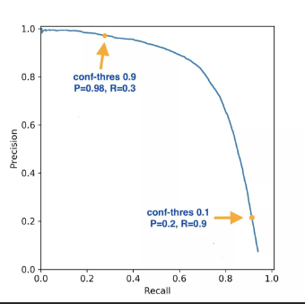
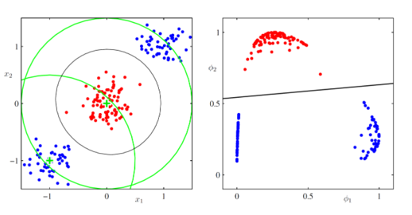
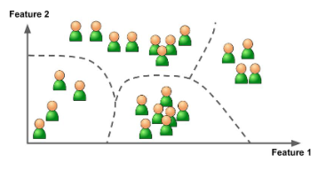
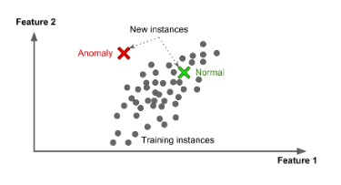

# Inteligência Artificial

- `Objetivo:` contruir sistemas que executem tarefas que exigem "inteligência"
- Desde a década de 40, imediatamente, duas abordagens distintas:
    - `IA simbólica`
    - `Machine Learning, ML`

## IA Simbólica

O objetivo é construir um sistema capaz de **realizar deduções** apartir de regras muito bem definidas.
A principal característica é que depende de regras e é **fortemente simbólico**

---
### Fundamentos:

1. `Lógica matemática`

2. `Regras de produção`: 
    - Formalismo para representar o conhecimento
    - IF (condition)
    THEN (action)

    - `Exemplos:`
        - Sistema de consultoria financeira
        - Sistema de diagnóstico médico
3. `Algoritmos de busca (search algorithms):`
    - é necessário **navegar no espaço de regras** (do conhecimento) para encontrar soluções.
    - Alguns problemas podem ser enquadrados como **problemas de busca**
### Sistemas especializados (Expert Systems)

Há uma sequência:
- Especialista humano ->
- Engenheiro do conhecimento -> 
- Base de conhecimento <-> 
- Mecanismo de inferência <->
- Interface ->
- usuário
 
---

### Sucessos na IA clássica

- `Planegamento:`
    
    - `Rovers:` que podem planejar e navegar de forma autônoma em um ambiente complexo
    
    - `Robôs de Armazém Automatizado:` veículos guiados automaticamente (AGVs) para gerenciamento de armazém.

- `Sistemas na área do Direito`
    
    - `Verificação de conformidade`
    
    - `Split-up`
- `Sistema de apoio clínico`
- `Sistema de apoio para engenharia`

### Não funcionou para outras tarefas
- `Conhecimento declarativo` <-> `Conhecimento procedural`

## Machine Learning (ML)

Construir um modelo matemático com `parâmetros`
Utilizar dados para `ajustar` os `parâmetros`

---

### Em geral, IA baseada em aprendizado de máquina
- Escrevemos uma `função` que `resolve` nosso problema. A função depende de `parâmetros`
- Usamos os `dados` para encontrar os `parâmetros ideias` da função
- `Mais parâmetros` necessita de `mais dados` e `computadores` mais `poderosos`  
- Quanto mais parâmetros a nossa função fica mais poderosa, implicando em melhores resultados
- Isso é verdade para todo o campo do aprendizado de máquina

### Áreas de sucesso:
- `Veículos autônomos`
- `Visão computacional`
- `Processamento de linguagem natural:`
    - Reconhecimento de fala
    - Tradução automática
    - Sistemas de diálogo
- `Análise de Dados Científicos`

### Previsão vs Geração

Dadas fotos de cachorros e gatos, podemos querer ou classificar novas fotos ou gerar novas fotos

---

- `Classificar:` 
    - Cada foto é um ponto no espaço
    - Nossa função `Corta o espaço`
- `Gerar:`
    - No espaço de todas as imagens possíveis, cachorros e gatos formam 2 grupos distintos
    - Nossa função `Modela as distribuições`

#### Riscos da IA generativa
- `Alucinações`
- `Inundação de informações de baixa qualidade`
- `Deepfakes, desinformação e manipulação da opinião pública`
- `Bot ou não?` 

#### Riscos da IA preditiva:
- `Falta de transparência e explicabilidade`
    - Quais partes da imagem são mais importantes para a decisão?
- `RObustez fraca, vulnerabilidade`
    - Mesmo um pequeno ruído pode quebrar o dissernimento das classes
- `Aplicações: Armas inteligentes, armas autônomas, vigilância ou policiamento preditivo`

##### Viés
- `O sistema só pode ser tão bom quanto os dados com os quais é treinado`
- Se os dados refletirem desigualdades, esteriótipos ou desequilíbrios históricos, o sistema de IA aprenderá e replicará esses preconceitos

#### Impacto ambiental
- O treinamento de grandes modelos generativos de IA requer recursos computacionais significativos

# Aprendizagem Supervisionada
## Tipos de problemas na aprendizagem supervisionada
- `Problemas de regressão:` a saída desejada é um valor real
- `Problema de classificação:`a saída desejada é um rótulo de classe
## A ideia geral por trás da aprendizagem supervisionada
- `Aprendizagem:`usar os dados para ajustar os parâmetros `w` para que a função calculada seja a que resolve o problema
- Assim, dado o conjunto de dados:
    - Escolhemos um modelo (a forma geral de **$f_w$**)
    - ajustamos (`aprendemos`) os parâmetros de **$f_w$**
    - Usamos o modelo aprendido **$f_w$** para fazer previsões
- Os dados de treinamento devem ser semelhates àqueles para fazer a previsão

## Funções de erro
- Precisamos ``quantificar`` o ``erro`` do modelo com o conjunto atual de parâmetros
**$$
SSE = \sum_{n=1}^{N} (y_n - \hat{y}_n)^2
$$
$$
\text{CrossEntropy} = -\sum_{n=1}^{N} \left[ y_n \log(\hat{y}_n) + (1 - y_n) \log(1 - \hat{y}_n) \right]
$$**

## Técnicas de otimização

### Minimizando a função de erro
- A função de erro é uma superfície definida no espaço dos pesos. Geralmente é diferenciável.
### Abordagem geral
- `Procedimentos numéricos interativos:`
    - Escolha algum valor inicial **$w^{(0)}$** para o vetor dos pesos e, em seguida, mova-se pelo espaço dos pesos usando 
**$$
w^{(t+1)} = w^{(t)} + \Delta w^{(t)}
$$**
- Diferentes algoritmos envolvem diferentes escolhas para a atualização do vetor dos pesos 
**$\Delta w^{(t)}$**.
- Muitos algoritmos fazem uso de `informações do gradiente`.

### Otimização de descida de gradiente 
*(gradient descent optimization)*
- `Método batch (conjunto):` usa todo o conjunto de dados de uma só vez
**$$
w_{t+1} = w_t - \eta \cdot \nabla E(w)
$$**
    - Existem métodos mais eficientes do que esta simples atualização
- `Método estocástico (Stochastic Gradient Descent):`faz uma atualização com base em um datapoint por vez
**$$
w_{t+1} = w_t - \eta \cdot \nabla E_i(w)
$$**
    - onde **$\nabla E_i(w)$** é o erro devido ao datapoint $n$
    - Cenários intermediários: as atualizações são baseadas em subconjunto de datapoints.
- Pode ser `necessário` `executar` um algoritmo baseado em gradiente `várias` vezes, com `diferentes` pontos de `partida`

## Medindo o desempenho da generalização

### Os problemas de regressão e classificação são diferentes
- `Conjunto de teste:`
    - `Problemas de regressão:` as coisas são bastantes simples, pois só precisamos medir o quão longe estamos, em média, do resultado correto.
    - `Problemas de classificação:` masi complicados por duas razões:
        - A saída do meu sistema é um valor que tenho que interpretar como rótulo de uma classe e, dependendo de como eu interpretá-lo, podemos ter resultados diferentes
        - Pode haver uma `diferença` na `gravidade` do `erro`, dependendo de quais classes você troca.
### Problemas de regressão
- Pegamos um conjunto de teste de N pontos e medimos:
    - `Sum-of-Squares Error (SSE):`
**$$
SSE = \sum_{n=1}^{N} (y_n - \hat{y}_n)^2
$$**
    -`Root-mean-square error (RMS ou RMSE):` 
**$$
RMSE = \sqrt{\frac{\sum_{n=1}^{N} (y_n - \hat{y}_n)^2}{N}}
$$**

### Problemas de classificação
- Como podemos avaliar o desempenho de um classificador no conjunto de teste?

#### Classificação Binária

##### Matriz de confusão

- `Colunas:` **real**
- `Linhas:` **Previsto**

##### Medidas

- `Acurácia:` porcentagem de previsões corretas:
**$$
\frac
{𝑇𝑃 + 𝑇𝑁}{
𝑇𝑃 + 𝑇𝑁 + 𝐹𝑃 + 𝐹𝑁}
$$**
- `Precision:` a acurácia das previsões positivas (*quão preciso eu sou? Qual é a % de previões corretas de todas as que prevejo como P?*):
**$$
\frac{𝑇𝑃}
{𝑇𝑃 + 𝐹𝑃}
$$**
- `Recall (ou sensitivity):` Porcentagem de positivos que são previstos corretamente(*Quanto eu "cobri" o P?*)
**$$
\frac{𝑇𝑃}{𝑃} = \frac{𝑇𝑃}
{𝑇𝑃 + 𝐹𝑁}
$$**
- `Specificity:` porcentagem de negativos que são previstos corretamente (*quanto eu "cobri" o N?*)
**$$
\frac{𝑇N}{N} = \frac{𝑇N}
{TN + 𝐹P}
$$**

###### Trade-off precisão/recall
- Quanto `maior a precisão` (Das medidas que consegui positivo, quantas acertei?) `menor o recall`(Das positivas, quantas acertei?) 

###### Pontuação $F_1$
- A `média harmônica` de `precission` e `recall`

- É maior quando a precisão e o recall são altos.

###### A curva receiver operating characteristis (ROC)
- True Positive Rate (`TPR`)
    - Taxa de `verdadeiro positivo:` é o `recall`
    **$$
    \frac{TP}{P}
    $$**
- False Positive Rate (`FPR`)
    - Taxa de `falsos positivos`
    **$$
    \frac{FP}{N}
    $$**
- `Propriedades`:
    - Limitado no quadrado [0-1] do primeiro quadrante
    - Sempre começa em (0,0):
        - Limiar = 1, `todas` as `previsões são negativas`, `não há` como ter `falsos negativos `ou `verdadeiros positivos`
    - Sempre termina em (1,1):
        - Limiar = 0, `Acerta `todas as `previsões positivas`, e `erra` todas as `previsões negativas`
    - Melhor ponto em (0,1): 
        - Acerta tudo
    - Desempenho aleatório na diagonal principal

    - Uma maneira de `comparar` classificadores é medias a área ´
        - Um `classificador`puramente `aleatório` terá um `ROC AUC` igual a `0,5`

###### A curva Precision Recall (PR)
- `Recall (TPR):`% de `positivos` que são `previstos corretamente`
- `Precision:`a `acurácia` das `previsões positivas` 

#### Classificação Multiclasse
- A matriz de confusão é mais complexa

### Generalização
#### Avaliando o desempenho da generalização
- Depois que o sistema aprender, devemos avaliar o quão bom ele funcionará no futuro, em `novos` datapoints
#### Conjunto de treinamento, conjunto de validação, conjunto de teste
- Temos dois tipos de parâmetros:
    - `Parâmetros` que o `algoritmo ajusta`(**w**)
    - `Hiperparâmetros:` definidos pelo usuário (eles decidem a **forma** do modelo)
- O objetivo é a **generalização**

#### Crossvalidation
- `Útil` para quando temos `poucos dados`
- `Passos`:
    - Particionam os dados em **$S$** grupos
    - Usar **$S-1$** grupos para treinar e $1$ para teste
    - Repetir o passo 2 $S$ vezes
    - Faça a `média das pontuações` de desempenho dos $S$ `conjuntos de teste`
    - O `resultado` será o `desempenho` do `modelo`
- `Quando` $S = N$(tamanho do conjunto de dados) é chamado de Leave-one-out `(LOO)`

### Pré-processamento dos dados
#### Nota sobre funções de base fixa
- Podemos aplicar `transformações` das `entradas` $\phi(x)$
- O problema de `classificação` pode se tornar `mais fácil`

### Taxonomia de algoritmos de aprendizado de máquina baseado no tipo de dados
- `A. Aprendizagem Supervisionada`:
    - `Classificação`
    - `Regressão`
- `B. Aprendizada não supervisionada:`
    - `Clustering`
        -  
    - `Estimativa de densidade`
        - 
- `C. Aprendizagem semi-supervisionada`
    - `Treina` um modelo inicial com `dados rotulados` e usa-o para `prever` `rótulos` em `dados não rotulados`
- `D. Aprendizagem por Reforço`
    - Agente
    - sequência de `estados` e `ações`
    - somente no final uma recompensa é alcançada
    - `Problema de atribuição de crédito:` a recompensa deve ser atribuída aporpriadamente a todas as ações que levaram a ela.   

# Modelos lineares para regressão
## O problema de regressão
- Prever o valor de variáveis de destino t `contínuas` dado o valor de um vetor D-dimensional `x` de variáveis de entrada
- Dadas $N$ observações {${x_n}$}, juntamente com os valores de destino $tn$ correspondentes, o objetivo é prever o valor de t para uma novo valor de x.

# Modelos Lineares para Classificação

## O problema de classificação
- Dado um vetor de entrada $x$, atribuí-lo a uma das K classes discretas $C_k$ onde k = 1,...,K.
- `Classes` `são disjuntas`, o espacço de entrada é dividido em `regiões de decisão`
- `Linearmente separáveis:` conjuntos de dados cujas classes podem ser separadas exatamente por superfícies de decisão lineares
## Representando valores alvo
- `Duas classes (K = 2)`
    - `uma variável`, representação `binária` $t \isin {0,1}$
        - $t=1$ representa a classe $C_1$
        - $t=0$ representa a classe $C_2$
    - valor de `t` é a probabilidade de que a `classe seja C1$`

- `K > 2 classes`
    - conveniente usar codificaçõa 1-de-K
## 1. Aprendizagem de funções discriminantes
- `Um discriminante é uma função que pega um vetor de entrada x e o atribui a uma das K classes`
### A. Duas classes (K = 2)
- O discriminante linear mais simples:
**$$
y(x) = w^Tx + w_0
$$**
    - x atibuído a **$C_1$** se **$y(x) >= 0$**
    - x atribuído a **$C_2$** caso contário.
**$$
y(\mathbf{x}) = \tilde{\mathbf{w}}^\top \tilde{\mathbf{x}}
$$** incluindo o bias

- `Fronteira de decisão: ` **$y(x)=0$**, corresponde a um `hiperplano (D-1)-dimensional` no `espaço` de `entrada` `D-dimensional`
- A `superfície de decisão` é:
    - `perpendicular` a w
    - seu deslocamento da origem é controlado pelo parâmetro de bias $w_0$

- `w` controla a `orientação`
- o bias controla a posição
### B. Múltiplas classes (K > 2)
- Combinações de discriminates de 2 classes não funcionam!
    - Sempre `haverá` uma `região` em que o `discriminante` `não` será `capaz` de `distinguir` duas `classes` ou mais 
-` Não há` uma `solução` realmente `boa` para esse problema

## Discriminante Linear de Fisher
- 1) `Projete` os `pontos` `em` uma dimensão: **$y = w^Tx$**
- 2) Se o valor (escalar) for maior que $w_0$, então $C_1$, senão $C_2$
- A questão agora é `ajustar` a `projeção` de forma a ter os pontos pertencentes às `classes` diferentes `os mais separados possíveis`
-  A medida mais simples da separação é a `separação das médias das classes projetadas`
- Ou podemos `maximizar` a `separação` e `diminuir` a `variância` dentro de cada `classe`
## O Perceptron
- Um modelo de duas classes:
\[
\mathbf{w}^{(\tau+1)} = \mathbf{w}^{(\tau)} + \eta \boldsymbol{\phi}_n t_n
\]
- Não é garantido que  a regra de aprendizado irá reduzir a função de erro total em cada passo
- Se o conjunto é linearmente separável, então o precéptron irá encontrar uma solução exata
-`Limitado no que pode aprender`

## O modelo geral
**\[
y(\mathbf{x}) = f\left( \mathbf{w}^\top \mathbf{x} + w_0 \right)
\]**
- Para prever rótulos de classe, transformamos a função linear de **w** usando uma `função de ativação não linear`**$f(.)$**
- O `modelo não é linear` nos parâmetros
- As `superfícies de decisão` são `funções lineares` de ***x***, ``mesmo`` que a função **$f(.)$** seja ``não linear``
### Regressão Logística (2 classes)
**\[
y(\boldsymbol{\phi}) = \sigma \left( \mathbf{w}^\top \boldsymbol{\phi} \right)
\]**
- Um sigmóide logístico atuando em uma função linear do vetor de características (features) **$\phi$**

**\[
E(\mathbf{w}) = - \sum_{n=1}^{N} \left\{ t_n \ln y_n + (1 - t_n) \ln (1 - y_n) \right\}
\]**
**\[
\nabla E(\mathbf{w}) = \sum_{n=1}^{N} (y_n - t_n)\boldsymbol{\phi}_n
\]**

- Para aprender **w** pode-se usar um `procedimento sequencial` onde os datapoints são apresentados um de cada vez e os `vetores de peso` são `atualizados` pela `descida` do `gradiente estocástico`
